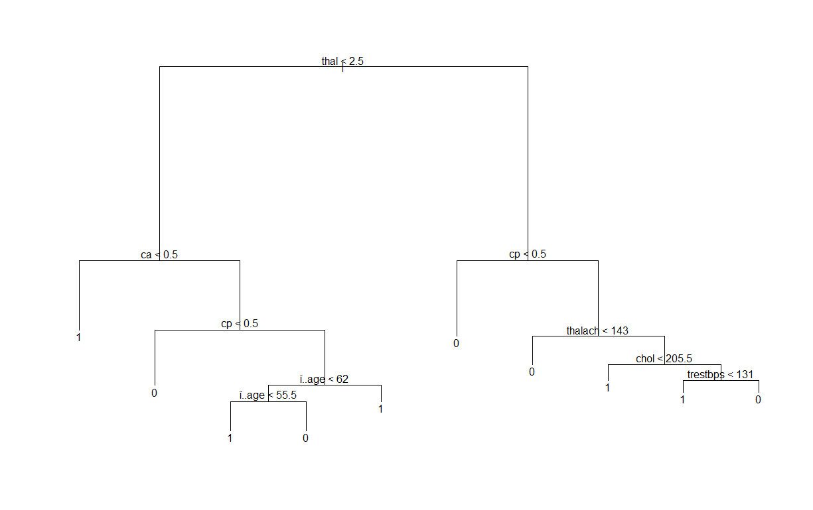
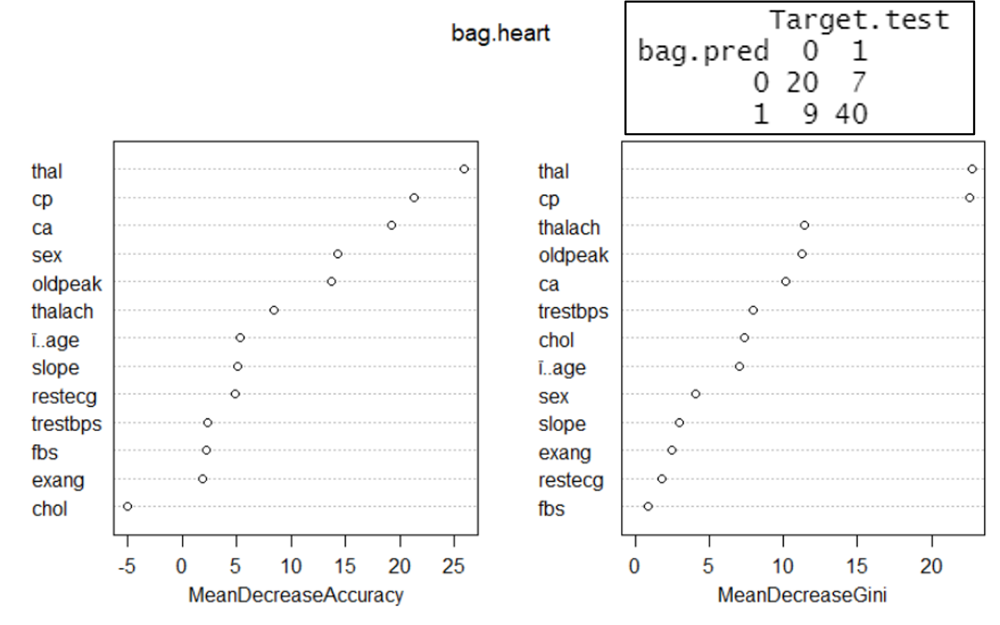
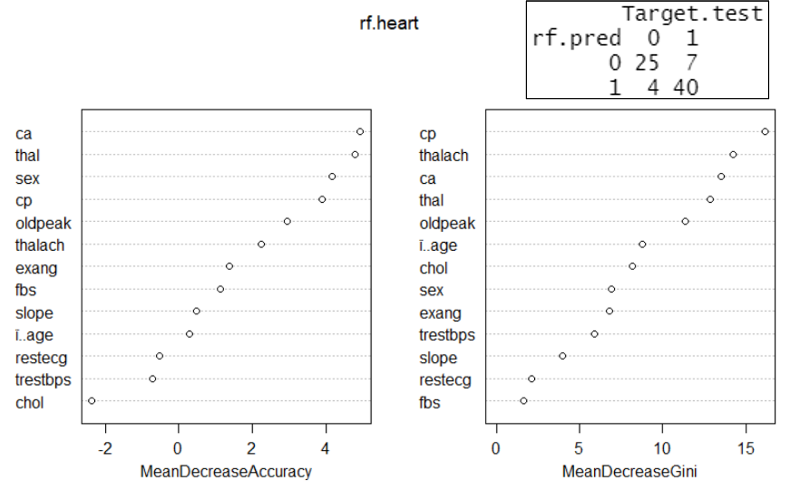
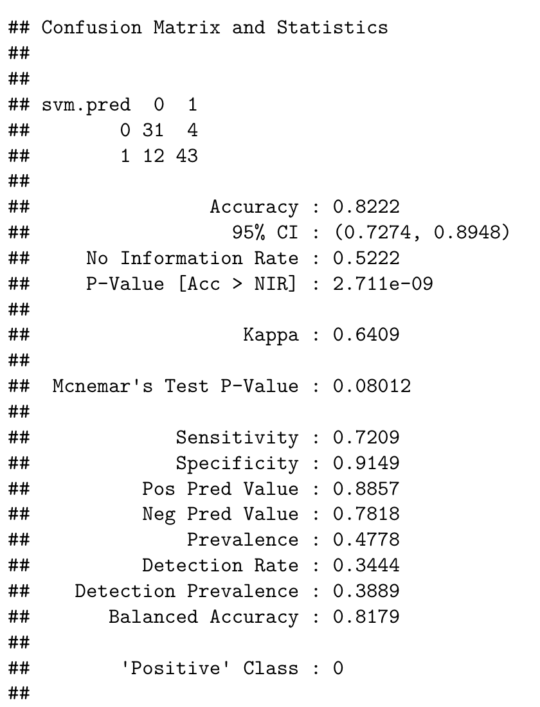
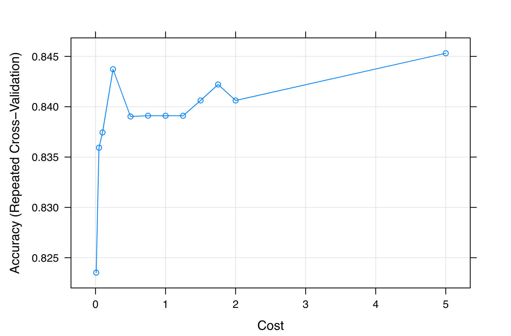
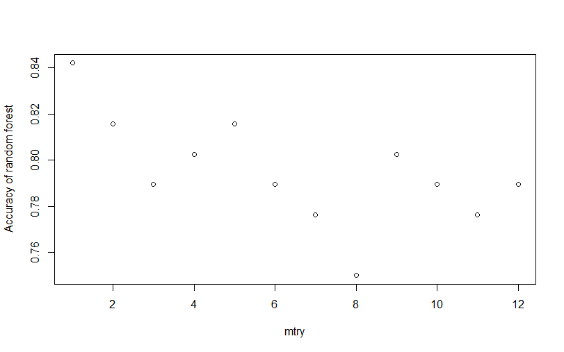
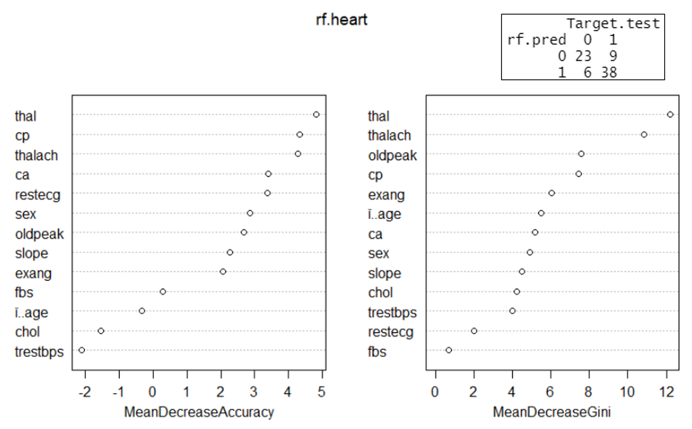

# I. Introduction

The goal of this project was to predict the probability of having a heart attack using 14 variables given in the heart.csv data-set. The classification models chosen to analyze this data-set were: random forest, bagging, support vector machines (SVM), and k-nearest neighbor (KNN). After exploring these various classification methods, we can analyze and interpret the results of each method to determine which might be the “best” classifier. Additionally, the logistic regression methods, lasso and elastic net, were taken into consideration to explore which variables are most important. (add sentence on the importance of this)


**Attribute Information:**

  - `age`
  - `sex`
  - `cp`: chest pain type (4 values)
  - `trestbps`: resting blood pressure
  - `chol`: serum cholesterol in mg/dl
  - `fbs`: fasting blood sugar > 120 mg/dl
  - `restecg`: resting electrocardiograph results (values 0, 1, 2)
  - `thalach`: maximum heart rate achieved
  - `exang`: exercise induced angina
  - `oldpeak`: ST depression induced by exercise relative to rest
  - `slope`: the slope of the peak exercise ST segment
  - `ca`: number of major vessels (0 - 3) colored by fluoroscope
  - `thal`: thalassemia (blood disorder) 0 = normal; 1 = fixed defect; 2 = reversible defect
  - `target`: 0 = less chance of heart attack; 1 = more chance of heart attack


# II. Classification Methods Explored

## Decision Trees
Decision trees are useful in classification to improve prediction accuracy. We explored bagging and random forest models. Figure 1 shows a classification tree used to predict whether someone is more or less likely to have a heart attack based on certain thresholds for each of the 14 predictors. 

{height=60%}


Next, we decided to prune the classification tree, shown in figure 2. 

{height=25%}

We can also look at the prediction accuracy (??) for both the original (see figure 3) and pruned trees and compare the outputted results.

{height=6%}


### Bagging

Next, we used bagging, which is useful to reduce the variance and improve the prediction accuracy. The results of bagging are shown in figure 4. Given these results, we can conclude that thalassemia and chest pain type of the two most important attributes.  

{height=20%}

### Random Forest
Finally, random forest was used to improve upon bagging and further improve prediction accuracy, shown in figure 5. We can see that after performing random forest, the variables of importance have changed. While thalassemia and chest pain type are still important, the random forest analysis shows that maximum heart rate achieved and number of major vessels are also of importance.

{height=20%}

\newpage

## Support Vector Machines

SVM is a supervised classification method that separates data using *hyperplanes*, which act as a decision boundary between the various classes. Here we use a classifier for predicting whether a patient is suffering from any heart disease or not. 

### Model Training and Accuracy:

We first train a linear classifier with the help of a *train control* method that uses *repeated cross-validation*, and then calculate prediction accuracy (82.2%) using a *confusion matrix*.

```{r echo=FALSE, out.width="35%", out.height="35%", fig.align='center', fig.cap='Confusion Matrix with Cost = 1'}
library(knitr)

```

### Choosing Different Costs:

In order to improve model performance, we play with *Cost (C)* values in our classifier. For this we define a grid with specific *C* values. We then train our model again using the new *C* values. Our prediction accuracy is the most (83.5%) when $C = 0.01$, reflected in the plot below.

```{r echo=FALSE, out.width="50%", out.height="50%", fig.align='center', fig.cap='Accuracy Plot with Varying Costs'}

```

### Tuned Model:

Finally, we test the model for the same *C* values. We do this by using *predict* over the *tuned* training model and the testing data-set, and checking the accuracy using the *confusion matrix*. We note that this ends up giving a higher accuracy rate (83.3%). 

```{r echo=FALSE, out.width="35%", out.height="35%", fig.align='center', fig.cap='Confusion Matrix of the Tuned Model'}
include_graphics("./confusion_matrix_tuned.png")
```

## KNN

## Logistic Regression

### Lasso

### Elastic Net

# III. Analysis

## Best Model

Random Forest Plots

{height=20%}

{height=20%}


{A couple paragraphs on determining a best model for each classfication method - should have 6 total}

## Comparison of Models

{Determine then the best model by looking at prediction accuracy and MSE (for logistic regression)}

# IV. Conclusion

# V. Notes and References


