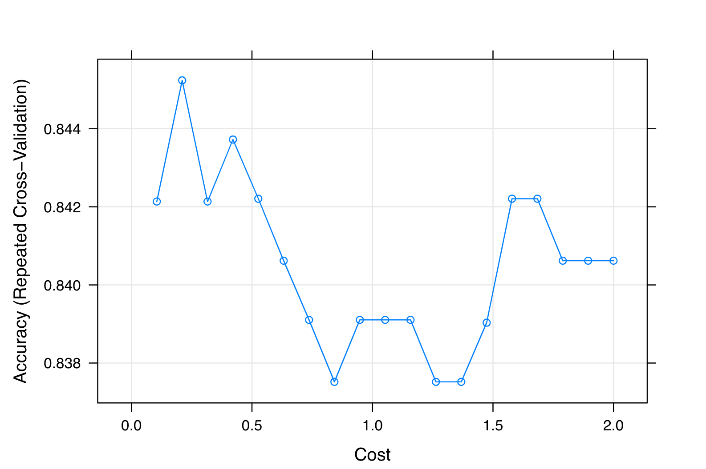

# I. Introduction

The goal of this project was to predict the probability of having a heart attack using 14 variables given in the heart.csv data-set. The classification models chosen to analyze this data-set were: random forest, bagging, support vector machines (SVM), and k-nearest neighbor (KNN). After exploring these various classification methods, we can analyze and interpret the results of each method to determine which might be the “best” classifier. Additionally, since the dependent variable is dichotomous (binary), (two) logistic regression models were taken into consideration for predictive analysis. The logit models help us determine the probability that a person is likely to suffer from a heart disease or not.

The data used is the [heart.csv](https://www.kaggle.com/nareshbhat/health-care-data-set-on-heart-attack-possibility) data. It contains the following attributes:

  - `age`
  - `sex`
  - `cp`: chest pain type (4 values)
  - `trestbps`: resting blood pressure
  - `chol`: serum cholesterol in mg/dl
  - `fbs`: fasting blood sugar > 120 mg/dl
  - `restecg`: resting electrocardiograph results (values 0, 1, 2)
  - `thalach`: maximum heart rate achieved
  - `exang`: exercise induced angina
  - `oldpeak`: ST depression induced by exercise relative to rest
  - `slope`: the slope of the peak exercise ST segment
  - `ca`: number of major vessels (0 - 3) colored by fluoroscope
  - `thal`: thalassemia (blood disorder) 0 = normal; 1 = fixed defect; 2 = reversible defect
  - `target`: 0 = less chance of heart attack; 1 = more chance of heart attack

Of the 14 attributes, the binary "target" variable is considered the response variable, dependent on the remainder of the attributes. For the remainder of this report, all models considered using the 13 predictor variables to perform prediction on "target".


# II. Classification Methods Explored

## Decision Trees

Decision trees are useful in classification to improve prediction accuracy. We explored bagging and random forest models. Figure 1 shows a classification tree used to predict whether someone is more or less likely to have a heart attack based on certain thresholds for each of the 14 predictors.

{height=60%}


Next, we decided to prune the classification tree, shown in figure 2. As we can see, the pruned tree reduced the number (add more here)

{height=25%}

We can also look at the prediction accuracy (??) for both the original (see figure 3) and pruned trees and compare the outputted results.

{height=6%}


### Bagging:

Next, we used bagging, which is useful to reduce the variance and improve the prediction accuracy. The results of bagging are shown in figure 4. Given these results, we can conclude that thalassemia and chest pain type of the two most important attributes.

{height=20%}

### Random Forest:
Finally, random forest was used to improve upon bagging and further improve prediction accuracy, shown in figure 5. We can see that after performing random forest, the variables of importance have changed. While thalassemia and chest pain type are still important, the random forest analysis shows that maximum heart rate achieved and number of major vessels are also of importance.

{height=20%}

Random Forest Plots

{height=20%}

{height=20%}

\newpage

## Support Vector Machines

SVM is a supervised classification method that separates data using *hyperplanes*, which act as a decision boundary between the various classes. Here we use a classifier for predicting whether a patient is suffering from any heart disease or not.

### Model Training and Accuracy:

We first train a linear classifier with the help of a *train control* method that uses *repeated cross-validation*, and then calculate prediction accuracy (77.8%) using a *confusion matrix*.

```{r echo=FALSE, out.width="35%", out.height="35%", fig.align='center', fig.cap='SVM Accuracy with Cost = 1'}
library(knitr)
include_graphics("./svm_accuracy.png")
```

### Choosing Different Costs:

In order to improve model performance, we play with *Cost (C)* values in our classifier. For this we define a grid with specific *C* values. We then train our model again using the new *C* values. Our prediction accuracy is the most (84.5%) when $C = 5$, reflected in the plot below.

```{r echo=FALSE, out.width="50%", out.height="50%", fig.align='center', fig.cap='Accuracy Plot with Varying Costs'}

```

### Tuned Model:

Finally, we test the model for the same *C* values. We do this by using *predict* over the *tuned* training model and the testing data-set, and checking the accuracy using the *confusion matrix*. We note that this ends up giving a higher accuracy rate (78.9%).

```{r echo=FALSE, out.width="35%", out.height="35%", fig.align='center', fig.cap='Accuracy of the Tuned SVM Model'}

```

\newpage

## KNN

The K-nearest neighbors algorithm is a simple algorithm that closely follows the concept of the Bayes classifier. For a given data, with predictor variables, $X$, and a response variable, $y$ with $k$ classes, the Bayes classifier seeks to first establish a conditional probability of the classes of $y$ given $X$. With a new observation, $x_n$, the prediction made is the class $j$ with the highest conditional probability given $x_n$.

Establishing a conditional distribution for the data at hand may be impossible. Consequently, the KNN algorithm uses a frequentist approach to establish a conditional probability distribution for only subsets of the data. For a new observation $x_n$, the KNN algorithm finds the distance from $x_n$ to each of the points in $X$, selecting the $k$ nearest points. These are the $k$ nearest neighbors of $x_n$. Let $y^{(kn)}$ be the classes of the $k$ nearest neighbors of $x_n$. With this subset of data points, a conditional probability is calculated as in (\ref{eqn:j1}).
\begin{equation}
  Pr(Y=j|X=x_n) = \frac{1}{k} \sum_{y_i\in y^{kn}}{I(y_i=j)}
  \label{eqn:j1}
\end{equation}

In (\ref{eqn:j1}), $I$ is the indicator function that evaluates to 1 if the condition holds, and 0 if otherwise. Thus, (\ref{eqn:j1}) determines a frequency, which also is the conditional probability given $x_n$ for each class $j$ of the response variable. The predicted class, therefore, is $j$ such that Pr(Y=j|X=x_n) is maximum.

The KNN algorithm is applied to the normalized heart.csv data set, using an optimum value of $k=12$. The confusion matrix obtained is as shown below, and the accuracy obtained is 0.789.

{height=6%}

As $k$ is a hyper-parameter, it must be determined a priori. Through a 5-fold cross-validation, different values of $k$ are applied and the optimal is chosen. As observed from below, the best value of $k$ is 5. This was used in the remainder of the KNN study.

Considering that the KNN algorithm works by finding the distance of the new data point from the $k$ nearest points, it is likely that the effect of certain parameters which are on a higher scale will become dominant over others on a lower scale. This potentially affects the accuracy of prediction. It is therefore useful that the data is normalized prior to performing KNN. In this study, the Euclidean distance was used, and normalization applied as follows. Let $X$ be the data set of parameters, and let $X_{min}$ be the $1\times p$ minimum vector of $X$. Also, let $X_{max}$ be the $1\times p$ column-wise maximum vector of $X$. Then, in this application, for each data point, $X_i$, normalization is performed according to (\ref{eqn:j2}).
\begin{equation}
  X_{inorm}  = \frac{X_i - X_{min}}{X_{max} - X_{min}}
  \label{eqn:j2}
\end{equation}

Without normalization, the following prediction table was obtained for an optimal $k=5$. The corresponding accuracy is 0.684.

{height=6%}

In an earlier section, the accuracy of the KNN algorithm applied to the normalized data was 0.789. Compared to the accuracy of the un-normalized data, one can see an improvement of over 15% accuracy. This underscores the need for normalization of data for especially distance-based algorithms such as the KNN.

## Logistic Regression

LR predicts whether something is *True* or *False* instead of predicting something continuous. Here, we try to predict the probability that a person will get a heart disease or not.

### Pre-processing Data:

For accurate predictions, we first process the raw data and convert a significant chunk of the variables into factors.

```{r echo=FALSE, out.width="40%", out.height="40%", fig.show='hold', fig.align='center', fig.cap='Raw (left) and Processed (right) Data'}
include_graphics(c("./raw_data.png", "./processed_data.png"))
```

### Comparing Models:

We now compared the $R^2$, `AIC`, and `BIC` values of the two models - one with only age as the independent variable and another with all the variables. The second model is the better model since it has a higher $R^2$ and a lower `BIC`, which is an indicator of a better fit. We note that since the median age in our data-set is 55, it makes sense why it *is not* a statistically significant variable in our complex model (that covers all variables). With an `AIC` value of 225.6 (versus 396.8), the second model is again, a better fit.

```{r echo=FALSE, out.width="40%", out.height="40%", fig.show='hold', fig.align='center', fig.cap='Simple (left) and Complex (right) Models'}
include_graphics(c("./simple_logistic_model.png", "./complex_logistic_model.png"))
```

### Predicting Probability of Heart Disease:

We plot the probability of predicting whether a person in our data-set has a heart disease. The upper-right portion of the logistic curve (cyan) shows the probability a person *will* get a heart disease. The bottom-right portion of the logistic curve (light orange) shows the probability a person *will not* get a heart disease.

```{r echo=FALSE, out.width="60%", out.height="60%", fig.align='center', fig.cap='Predicted Heart Disease Probability'}
include_graphics("./logistic_prediction.png")
```

### Model Accuracy:

Finally, we train the second model and predict its accuracy (77.8%) with a *confusion matrix*.

```{r echo=FALSE, out.width="35%", out.height="35%", fig.align='center', fig.cap='Logistic Regression Accuracy'}

```

\newpage

# III. Analysis


# IV. Conclusion

# V. References
