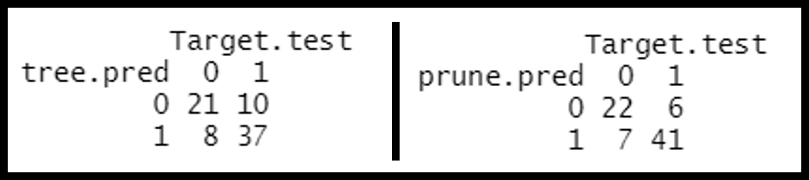

# I. Introduction

The goal of this project is to compare how various classification algorithms perform on a sample data set. The algorithms of interest are: decision tree (and its variant, random forest), support vector machine (SVM), and k-nearest neighbor (KNN). The data contains thirteen predictor variables and a dichotomous response variable, which indicates whether a patient has a high risk of heart attack or not. Therefore, additionally, (two) logistic regression models were taken into consideration for predictive analysis. 

The data used is the [heart.csv](https://www.kaggle.com/nareshbhat/health-care-data-set-on-heart-attack-possibility) data. It contains the following attributes:

  - `age`
  - `sex`
  - `cp`: chest pain type (4 values)
  - `trestbps`: resting blood pressure
  - `chol`: serum cholesterol in mg/dl
  - `fbs`: fasting blood sugar > 120 mg/dl
  - `restecg`: resting electrocardiograph results (values 0, 1, 2)
  - `thalach`: maximum heart rate achieved
  - `exang`: exercise induced angina
  - `oldpeak`: ST depression induced by exercise relative to rest
  - `slope`: the slope of the peak exercise ST segment
  - `ca`: number of major vessels (0 - 3) colored by fluoroscope
  - `thal`: thalassemia (blood disorder) 0 = normal; 1 = fixed defect; 2 = reversible defect
  - `target`: 0 = less chance of heart attack; 1 = more chance of heart attack

Here, the response varible is "target". Subsequently, for the remainder of this report, all models considered apply the 13 predictor variables to perform prediction on "target".


# II. Classification Methods Explored

## Decision Trees

Decision trees are perhaps the most human-friendly classification algorithm. The model produced is a tree, whose branches represent certain conditions. The tree-like output is easily understood. Using the given data set, the decision tree in Figure 1 was produced. For instance, if an individual has a thalassemia rating less than 2.5, greater than 0.5 major vessels, chest pain valued less than 0.5, and age greater than 62, then the tree predicts the individual  to have a high chance of heart attack.  

{height=60%}

The tree in Figure 1 has many branches, and subsequently, leaf nodes. Pruning is applied to reduce the size of the tree and increase its simplicity. In some cases, pruning also increases the prediction accuracy. The pruned tree is shown in Figure 2. As may be observed, the pruned tree has significantly fewer branches than the original, changing from four main branches to two. Pruning works by reducing the number of branches in the tree to include only the attributes that are of most importance in determining the response. For the pruned tree in Figure 2, these are thalassemia, number of major vessels, chest pain type, maximum heart rate achieved, cholesterol, age, and resting blood pressure. 

\newpage

{height=25%}

For both trees (original and pruned), we shall compare the prediction accuracy. Figure 3 shows the confusion matrix for each of the trees, and the prediction accuracy can be calculated from this by taking: $$\frac{\text{true positive} + \text{true negative}}{\text{true positive} + \text{true negative} + \text{false positive} + \text{false negative}}$$ 

{height=6%}

Based on the confusion matrix, true positive and true negative are given by the diagonal elements (i.e., values in the (00) and (11) positions). The prediction accuracy for the original tree and the pruned tree 76.32% and 82.89%, respectively. Therefore, in this application, pruning not only increased the simplicity of the tree, but also improved the prediction accuracy. 

### Bagging:

Next, we used bagging, which is useful to reduce the variance and potentially improve the prediction accuracy. The results of bagging are shown in Figure 4. Given these results, we can conclude that thalassemia and chest pain type are the two most important attributes, while serum cholesterol is the least important. Additionally the prediction accuracy, calculated from the confusion matrix in Figure 4, is 78.95%. Clearly, while bagging improves the prediction accuracy of the original tree, it under-performs, compared to the pruned tree which is simpler. 

{height=20%}

\newpage

### Random Forest:
Random forests are a variant of decision trees, combining several trees to make a single prediction. It builds a tree from randomly chosen subsets of the predictor variables. The final prediction for new data is the class predicted by majority of the trees in the forest. Applying random forest to the data set, the result shown in Figure 5 is obtained. One may observe that after performing random forest, the variables of importance have changed. While thalassemia and chest pain type are still important, their order of importance have changed, and the random forest has elevated maximum heart rate and number of major vessels in order of importance. Additionally, the prediction accuracy of 85.53% is a significant improvement over that of the pruned tree. This result is reasonable, and expected. The consensus of a collection of uncorrelated trees is likely to outperform the decision of a single tree. While some trees in the forest may output the wrong predictions, others would predict the correct response, so that altogether, a more objective consensus is reached. 

{height=20%}

\newpage

## Support Vector Machines

SVM is a supervised classification method that separates data using *hyperplanes*, which act as a decision boundary between the various classes. By nature, SVM suffers poor accuracy when the data does not have an explicit linear boundary. In such cases, the data may be projected into a higher dimension, and an appropriate hyperplane decision boundary fitted. 

### Model Training and Accuracy:

We first train a linear kernel SVM classifier with the help of a *train control* method that uses *repeated k-fold cross-validation*, and then calculate prediction accuracy (77.8%) using a *confusion matrix*. We also normalize variables to make their scale comparable by setting the `preProcess` option in the `caret` package. By default, the SVM linear classifier that gets built is using $C = 1$.

```{r echo=FALSE, out.width="35%", out.height="35%", fig.align='center', fig.cap='SVM Accuracy with Cost = 1'}
library(knitr)

```

### Choosing Different Costs:

In SVM, the cost function is important to control error, the margins around the decision boundary, and determines the possible misclassifications. It essentially imposes a penalty to the model for making an error - the higher the value of *C*, the less likely it is that the SVM algorithm will misclassify a point.

In order to improve model performance, the tuning parameter - *Cost (C)*, is varied in our classifier. For this, we define a grid with a range of *C* values. We then train our model again using the new cost grid. The best cost value that maximizes our model accuracy to 84.5% is when $C = 0.21$ (reflected in the plot below).

```{r echo=FALSE, out.width="50%", out.height="50%", fig.align='center', fig.cap='Accuracy Plot with Varying Costs'}
include_graphics("./svm_accuracy_plot.png")
```

### Tuned Model:

Finally, we test the model for the same *C* values. We do this by using *predict* over the *tuned* training model and the testing data-set, and checking the accuracy using the *confusion matrix*. We note that this ends up significantly improving the accuracy rate to 84.4%.

```{r echo=FALSE, out.width="35%", out.height="35%", fig.align='center', fig.cap='Accuracy of the Tuned SVM Model'}
include_graphics("./svm_tuned_accuracy.png")
```

\newpage

## KNN

The K-nearest neighbors algorithm is a simple algorithm that closely follows the concept of the Bayes classifier. For a given data, with predictor variables, $X$, and a response variable, $y$ with $k$ classes, the Bayes classifier seeks to first establish a conditional probability of the classes of $y$ given $X$. With a new observation, $x_n$, the prediction made is the class $j$ with the highest conditional probability given $x_n$.

Establishing a conditional distribution for the data at hand may be impossible. Consequently, the KNN algorithm uses a frequentist approach to establish a conditional probability distribution for only subsets of the data. For a new observation $x_n$, the KNN algorithm finds the distance from $x_n$ to each of the points in $X$, selecting the $k$ nearest points. These are the $k$ nearest neighbors of $x_n$. Let $y^{(kn)}$ be the classes of the $k$ nearest neighbors of $x_n$. With this subset of data points, a conditional probability is calculated as in (\ref{eqn:j1}).
\begin{equation}
  Pr(Y=j|X=x_n) = \frac{1}{k} \sum_{y_i\in y^{kn}}{I(y_i=j)}
  \label{eqn:j1}
\end{equation}

In (\ref{eqn:j1}), $I$ is the indicator function that evaluates to 1 if the condition holds, and 0 if otherwise. Thus, (\ref{eqn:j1}) determines a frequency, which also is the conditional probability given $x_n$ for each class $j$ of the response variable. The predicted class, therefore, is $j$ such that $Pr(Y=j|X=x_n)$ is maximum.

### Effects of Normalization
Considering that the KNN algorithm works by finding the distance of the new data point from the $k$ nearest points, it is likely that the effect of certain parameters which are on a higher scale will become dominant over others on a lower scale. This potentially affects the accuracy of prediction. It is therefore useful that the data is normalized prior to performing KNN. In this study, the Euclidean distance was used, and normalization applied as follows. Let $X$ be the data set of parameters, and let $X_{min}$ be the $1\times p$ minimum vector of $X$. Also, let $X_{max}$ be the $1\times p$ column-wise maximum vector of $X$. Then, in this application, for each data point, $X_i$, normalization is performed according to (\ref{eqn:j2}).
\begin{equation}
  X_{inorm}  = \frac{X_i - X_{min}}{X_{max} - X_{min}}
  \label{eqn:j2}
\end{equation}

Without normalization, the following prediction table was obtained for $k=5$. The corresponding accuracy is 0.684.

{height=6%}


However, when applied to the normalized data set, using an optimum value of $k=12$, the confusion matrix obtained is as shown below, and the accuracy obtained is 0.789. Compared to the accuracy of the un-normalized data, one can see an improvement of over 15%. This underscores the need for normalization of data for especially distance-based algorithms such as the KNN.


{height=6%}

It must be noted that $k$ is a hyper-parameter, and was determined a priori. Through a 5-fold cross-validation, different values of $k$ were applied and the optimal was chosen. The optimal value was 12 for the normalized data and 5 for the un-normalized data.


## Logistic Regression
Logistic regression works by first fitting a linear model to the data to obtain a continuous response. This is then categorized by taking a logit evaluation. Based on whether the final outcome is greater than 0.5 or not, a binary response is predicted. As it begins with a linear model, logistic regression lends itself to several different analysis techniques such as shrinkage, and subset selection, which determine the most important predictor variables to use in the model. 

### Pre-processing Data:
For accurate predictions, the data was processed to convert all variables into boolean or categorical variables.

```{r echo=FALSE, out.width="40%", out.height="40%", fig.show='hold', fig.align='center', fig.cap='Raw (left) and Processed (right) Data'}
include_graphics(c("./raw_data.png", "./processed_data.png"))
```

We use `xtabs` to confirm that healthy and unhealthy samples come from each gender. We do the same for the `cp` parameter to verify that all 4 levels of chest pain were reported by most patients. For the resting electrocardiographic `restecg` parameter, it is interesting to note that only 4 patients represent level 1.

```{r echo=FALSE, out.width="20%", out.height="20%", fig.show='hold', fig.align='center', fig.cap='Healthy and Unhealthy Samples by Gender (left), Chest Pain (Center), and Resting ECG (right)'}
include_graphics(c("./logit_sample_dist.png", "./logit_sample_dist2.png", "./logit_sample_dist3.png"))
```

### Comparing Models:

We call the `glm()` function that performs Generalized Linear Models, and start with a rather simple model where we try to predict heart disease using only the gender of each patient. This simple model is then compared to a second (complex) model with all the variables. The model that fits better is determined on the basis of $R^2$, `AIC`, and `BIC` values.

***Simple model:*** 
$\text{heart disease} = 1.0986 - 1.3022 \times \text{the patient is male}$

If the patient is female, the above equation becomes, $\text{heart disease} = 1.0986 - 1.3022 \times 0$. Therefore, the `log(odds)` that a female has heart disease is 1.0986.

If the patient is male, the equation for predicting heart disease becomes, $\text{heart disease} = 1.0986 - 1.3022 \times 1$. The first term in this equation represents the `log(odds)` of a female having a heart disease, the second term  represents the decrease in the `log(odds)` that a male has of having heart disease. 

We construct the second model using `glm()`, and find out that it fits better since it has a higher $R^2$ and a lower `BIC` (indicator of a better fit). We note that since the median age in our data-set is 55, it makes sense why it *is not* a statistically significant variable in our complex model's (that covers all variables) `summary()`. With an `AIC` value of 225.6 (versus 396.8), the second model is again, a better fit.

```{r echo=FALSE, out.width="40%", out.height="40%", fig.show='hold', fig.align='center', fig.cap='Simple (left) and Complex (right) Models'}
include_graphics(c("./simple_logistic_model.png", "./complex_logistic_model.png"))
```

### Predicting Probability of Heart Disease:

We plot the probability of predicting whether a person in our data-set has a heart disease. The upper-right portion of the logistic curve (cyan) are data with a negative response (i.e., low chance of heart attack), while the bottom-right portion of the logistic curve (light orange) are data with a positive response (i.e. high chance of heart attack).

```{r echo=FALSE, out.width="60%", out.height="60%", fig.align='center', fig.cap='Predicted Heart Disease Probability'}

```

### Model Accuracy:

Finally, we train the second model and predict its accuracy (77.8%) with a *confusion matrix*.

```{r echo=FALSE, out.width="35%", out.height="35%", fig.align='center', fig.cap='Logistic Regression Accuracy'}
include_graphics("./logistic_accuracy.png")
```

\newpage

# III. Final Analysis

The table below summarizes the results from the various classification algorithms. As is readily observed, the random forest algorithm performed the best for this data set, and is followed by the pruned tree. Altogether, the tree models appear to outperform the other methods. The added advantage of the tree model is its interpretability, which is a useful property to have, especially for making quick human decisions.


**Table of prediction accuracy for each of the six methods explored**

Classification Method         | Prediction Accuracy (%) |
| :-------------------------: | :---------------------: | 
Decision Tree                 |            76.32        |   
Pruned Decision Tree          |            82.89        |
Bagged Tree                   |            78.95        |
Random Forest                 |            85.53        |
Support Vector Machines       |            84.44        |
KNN                           |            78.90        |
Logistic Regression           |            77.80        |

While the tree models outperformed the others, it is unclear whether this is the case for data with categorical response variable. Therefore, we limit this assertion to this experiment only. 

One observation from this experiment is that compared to the other models, the tree models and KNN appeared to have very little subjectivity about them. For instance, there are very few tune-able parameters in random forest. This is not so with algorithms such as logistic regression. Their dependence on a prior linear model indicates that the accuracy is heavily dependent on the type, size, and accuracy of linear model used. The same is true of SVMs, whose accuracy depends on the kernel function applied. The extensiveness of tune-able details with these other algorithms may explain why their accuracy, in this experiment, is inferior to that of the tree models; it is likely that a combination of tune-able parameters exists which may have produced better or comparable results. 

Due to time constraints, our group was unable to explore other more exotic methods. For instance, some questions persist: is it possible to create a random forest of pruned trees? How about applying K-Means? Is it possible to develop a K-Means algorithm that takes into account the variance of each cluster for decision making? It would have been interesting to observe the outcome of these experiments. 

# IV. Conclusion

In this report, about five classification algorithms have been applied to a data set with thirteen predictor variables and a dichotomous response variable. The results show that among the applied algorithms, random forests performed the best, achieving a prediction accuracy of over 85%. While the results are promising, it remains unclear whether this superior performance of random forests on such data is generic and not limited to our choice of data set. 

# V. References

[1] https://archive.ics.uci.edu/ml/datasets/Heart+Disease